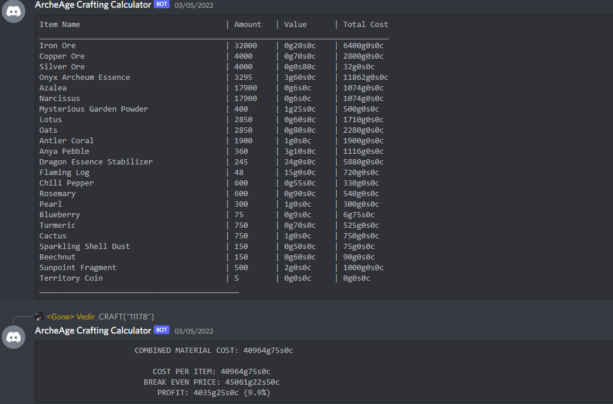

# ArcheAge Crafting Calculator

### Latest Update: 28/08/2022 (v.0.15.0.71)

- Introduced a labour calculator (including support for labour usage reduction with higher proficiency).
- Added a profit/labour measure.

### Basic Features

- Recursive Recipe Breakdown
- Crafting path choice based on cost
- Profit calculator
- Discord bot mode
- Local data support
- Online data support (including sync over FTP)

### Upcoming Features

- Lua scripting support (partially implemented, needs some refactoring to avoid duplicated functionality)
- Telegram bot mode
- Web app mode
- Overlay mode
- Step-by-step calculator mode
- Single, easily accessible settings file.

Currently available on the Microsoft Store - for other releases, contact me.

### Find it on the Microsoft Store!
[Download it here!](https://apps.microsoft.com/store/detail/archeage-crafting-calculator/9P4D652FVH6W)

